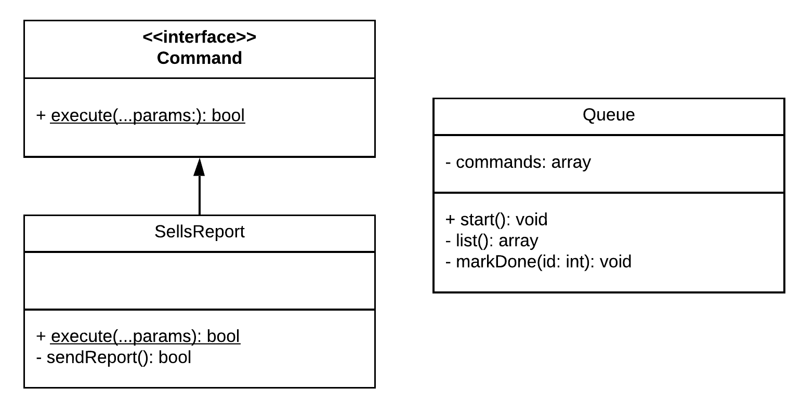

# Command

Existem casos em que é necessário realizar operações sem conhecer as regras desta ou então não conhecendo o receptor. Por isso o padrão Command existe, tendo como objetivo resolver os casos em que é necessário encapsular a solicitação de um objeto parametrizando diferentes solicitações.

## Implementação
A implementação é feita com base em uma classe responsável por receber tais requisições, com isso essas requisições podem ser salvas ou registradas, também existem os casos em que uma requisição é agendada (cron jobs) ou enfileirada (queues).

## Exemplo
Em um sistema, são solicitados diversos relatórios, com tipos e filtros diferentes. Tais relatórios não podem ser emitidos na hora pois há uma busca em grandes quantidades de dados e uma alta frequência, dessa forma é necessário que cada solicitação seja **enfileirada**

## Diagrama de classes

