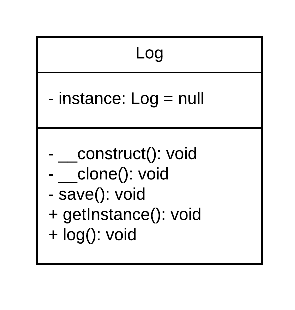

# Singleton

Existem casos em que uma classe deve ser acessado por todo o sistema e que é importante que esta tenha apenas uma instância. Existem diversos motivos para isso, por exemplo a concorrência em um arquivo ou a ocupação de memória principal desnecessária por diversas instâncias.

## Implementação
O padrão **Singleton** resolve este problema criando uma classe (não estática) que tem como atributo uma variável estática, ou seja, que só podem ser **inicializados uma vez**. Este atributo é responsável por armazenar a instância da própria classe.

## Exemplo
Suponhamos um sistema que para cada operação (inserção, atualização, visualização de dados e etc.) deva registrar um log. A maneira mais simples para isso é criar uma classe Log, responsável por salvar cada operação. Temos que:

-   A classe Log deve ser acessível por todo o sistema, isso pois as operações podem ser realizadas de diversas partes do sistema;
    
-   Por ser utilizada diversas vezes e por todos os usuários do sistema a classe, se mal implementada, será instanciada diversas vezes podendo gerar problemas (falta de memória ou concorrência por exemplo), com isso é necessário que haja uma única instância dessa classe.

## Diagrama de classes

