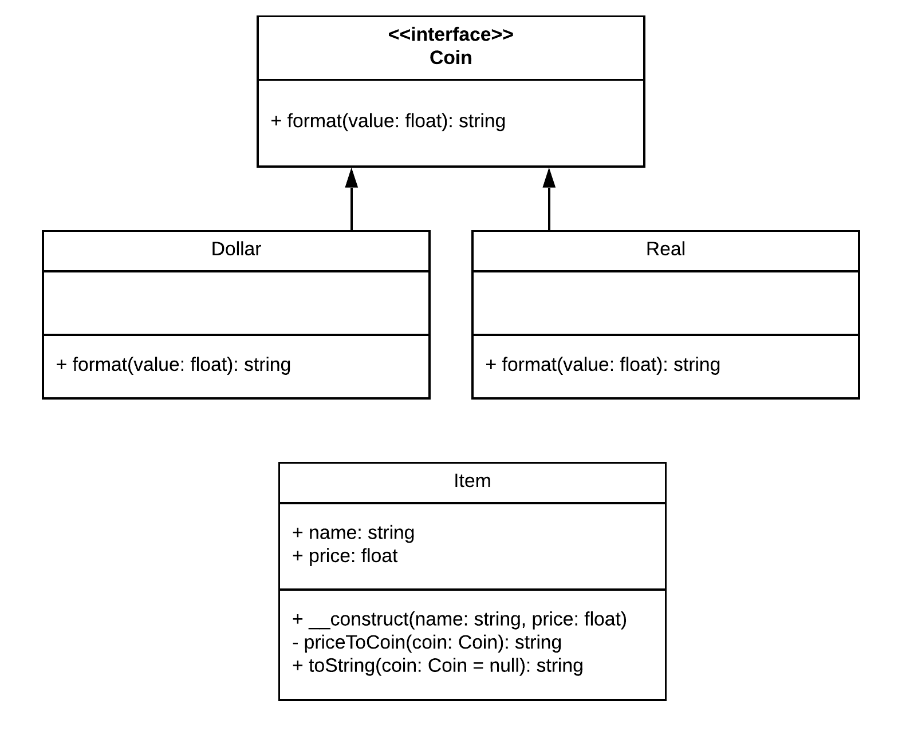

# Decorator

Algumas vezes é necessário **agregar responsabilidades ou características adicionais a objetos específicos** invés de adicionar a todas uma classe.

## Implementação

O **Decorator**, utiliza subclasses para adicionar propriedades ou responsabilidades a um determinado objeto. Geralmente há uma interface principal, responsável por ser a regra para todos os decorators de um determinado tipo. Então, no objeto que será decorado por esses há uma função responsável por aplicar esses decorators.  

## Exemplo
Um sistema de estoque de itens, tem sua versão disponibilizada em 2 países, Brasil e Estados Unidos. Com isso, é necessário que na exibição de cada item, seu preço esteja no padrão para utilizado pelo país. No futuro, pode ser que existam outros decoradores para cada item, como por exemplo o de datas ou a tradução do item.

## Diagrama de classes

